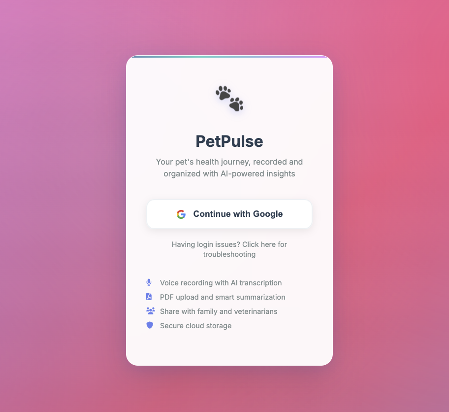
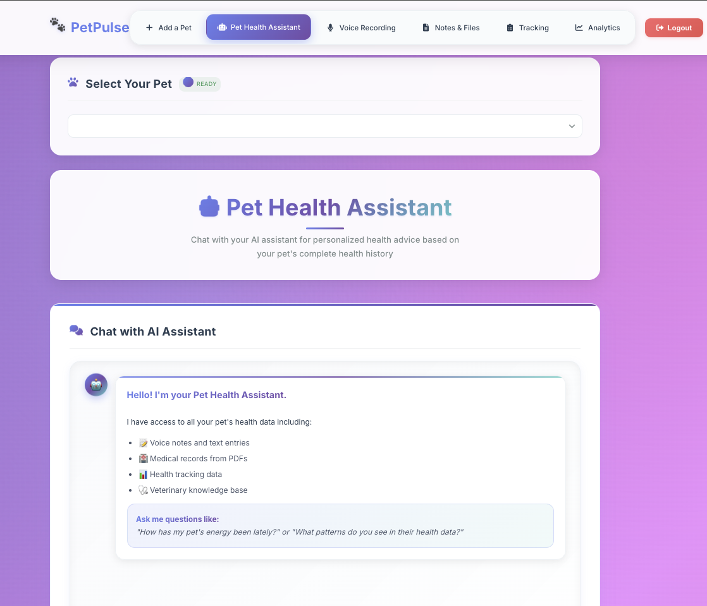

# Pet Health Voice Notes

[](https://python.org)
[](https://fastapi.tiangolo.com/)
[](https://openai.com/)
[](https://firebase.google.com/)
[](LICENSE)

<p align="center">
  
</p>

## The Problem

I noticed this pattern repeatedly among pet owners I know: subtle health changes that develop gradually often go untracked until they become obvious problems. Dogs start eating slightly less over weeks, but owners cannot pinpoint when it began or describe the progression clearly to vets. Cats become less active, dismissed as "getting older" until vet visits reveal underlying conditions that could have been caught earlier.

When I researched existing solutions, I found a clear gap: basic pet apps offer simple logging with no intelligence, while sophisticated health monitoring tools are designed for veterinary clinics, not individual pet owners. There was no solution that could intelligently analyze home observations and provide meaningful health insights for regular pet owners.

## The Solution

After talking to several pet-owning friends about their tracking challenges, I designed this system to make health monitoring effortless while providing the kind of pattern analysis that most owners struggle to do manually.

**Voice-First Design**: Based on feedback from friends who found typing cumbersome when their pets were acting concerning, I prioritized voice input. Tap to record "Buddy seems tired today, did not finish his breakfast" and the system transcribes, extracts health information, and categorizes it automatically.

**Pattern Recognition**: This addresses the exact problem many pet owners face - the AI analyzes all your notes and identifies trends like "You have mentioned lethargy 3 times this week" or "Eating patterns changed after the vet visit." It connects observations that owners typically do not link together.

**Natural Language Charts**: Instead of figuring out what data to plot, just ask "show me Buddy's energy levels this month" and it generates the right visualization automatically. The AI parses your question, selects appropriate data, and chooses the best chart type.

<p align="center">
  
</p>

## Problems I Solved While Building This

**Problem 1: OpenAI API costs and latency**
Early user testing with friends revealed that chart generation felt too slow. I was calling the OpenAI API every time someone requested a chart, which became expensive quickly and created noticeable delays that frustrated users.

*Solution*: Implemented a caching system that stores recent data for 30 minutes. Repeated requests now return instantly and API costs were reduced by approximately 67%.

**Problem 2: Unstructured speech-to-text output**
During initial testing, I realized Google's speech API returns raw transcripts as continuous text blocks. If someone said "Max was limping today but ate his dinner fine," I got exactly that - no structure or useful health data extraction.

*Solution*: I process the transcript through OpenAI to extract relevant information and categorize it by type (medical observations, daily activity, feeding patterns, etc.).

**Problem 3: Dynamic visualization requirements**
User feedback revealed that people wanted to ask natural questions without learning interface complexity. "Show me feeding times" clearly needs a different visualization approach than "show me energy levels over time," but users should not have to figure that out.

*Solution*: Implemented OpenAI function calling to parse natural language queries and automatically select appropriate chart types and data parameters.

## Architecture & Implementation

**FastAPI Backend**: Built with async/await throughout to handle concurrent API calls efficiently. FastAPI's automatic OpenAPI documentation generation eliminated the need for separate API docs - the interactive documentation at `/docs` shows all endpoints with request/response schemas.

**Firebase Integration**: Uses Firestore for real-time data synchronization and Firebase Auth for user management. When you add a voice note on mobile, it appears instantly on the web dashboard without refresh. The NoSQL structure handles nested pet data (notes, medical records, analytics) more naturally than relational tables.

**OpenAI Function Calling**: Instead of parsing user queries with regex, the system defines chart generation functions in JSON schema format. GPT-4 interprets natural language like "show me feeding patterns" and extracts the correct parameters (chart type, data filters, aggregation method). Much more reliable than GPT-3.5 for structured output.

**Speech Processing Pipeline**: Google Cloud Speech-to-Text converts audio to text, then OpenAI processes the transcript to extract health information and categorize observations. Tested multiple speech APIs - Google handled background noise (barking, household sounds) better than alternatives.

**Lightweight Frontend**: Used vanilla JavaScript instead of React to keep complexity focused on the backend systems. The UI needs were straightforward - forms, charts, and real-time updates via Firebase SDK.

## Technical Challenges & Solutions

**API Performance**: Initial OpenAI calls for chart generation took 2-3 seconds and became expensive with repeated requests. Implemented an in-memory cache with 30-minute TTL that reduced costs by 67% and made repeated queries instant. For production scale, Redis would be better, but this approach let me understand caching fundamentals.

**Speech-to-Text Processing**: Raw Google Speech API transcripts came as unstructured text blocks. Built a two-stage pipeline: first convert speech to text, then use OpenAI to extract structured health information and categorize observations by type (medical, feeding, exercise, etc.).

**Dynamic Visualization**: Different health questions need different chart types. Instead of building a complex UI for chart configuration, used OpenAI function calling to parse natural language queries and automatically select appropriate visualizations. Users ask "show me energy trends" and get line charts, or "feeding schedule" and get bar charts.

**Real-time Synchronization**: Pet tracking happens across devices - you might notice something on your phone but want to analyze trends on a computer. Firebase's real-time database updates mean notes appear instantly across all connected devices without manual refresh.

## Implementation Details

**OpenAI Function Calling**: The trickiest part was getting the function definitions right. You define your functions in JSON schema format, and GPT-4 figures out which one to call based on user input. Here is the chart generation function:

```python
functions = [
    {
        "name": "generate_dynamic_chart",
        "description": "Create custom visualizations with flexible parameters",
        "parameters": {
            "type": "object",
            "properties": {
                "chart_type": {"type": "string", "enum": ["bar", "line", "doughnut", "scatter"]},
                "x_axis": {"type": "string"},
                "y_axis": {"type": "string"},
                "filters": {"type": "object"},
                "aggregation": {"type": "string", "enum": ["count", "sum", "average"]}
            }
        }
    }
]
```

**Caching Implementation**: The caching system turned out simpler than expected. I store expensive OpenAI responses in memory for 30 minutes:

```python
@app.post("/api/pets/{pet_id}/preload")
async def preload_pet_data(pet_id: str):
    cache_key = f"pet_data_{pet_id}"
    cached_data = await cache.get(cache_key)
    
    if not cached_data:
        data = await aggregate_pet_data(pet_id)
        await cache.set(cache_key, data, expire=1800)  # 30 minutes
    
    return {"status": "cached"}
```

**Speech Pipeline**: Google gives you raw transcripts, but I needed structured health data. The transcript goes through OpenAI to pull out the important stuff and categorize it (medical vs feeding vs exercise, etc.).

## How It Performs

The caching implementation significantly improved performance - repeated requests now return instantly instead of waiting 2-3 seconds for OpenAI responses.

I built approximately 20 different API endpoints, which sounds extensive but FastAPI makes them straightforward to implement. The automatic documentation feature eliminates the need to maintain separate documentation.

Firebase handles multiple users automatically, which simplified development. I did not need to implement custom user management or authentication flows.

## What's In Here

```
pet-voice-notes/
├── api_server.py              # Main FastAPI app
├── intelligent_chatbot_service.py  # OpenAI function calling
├── simple_rag_service.py      # AI responses with breed info
├── visualization_service.py   # Chart generation
├── transcribe.py             # Speech-to-text processing
├── firestore_store.py        # Database + caching
├── public/                   # Frontend 
│   ├── main.html            # Main dashboard
│   └── index.html           # Login page
├── docker-compose.yml        # Simplified deployment
└── requirements.txt          # Python dependencies
```

The main logic is split across a few files because I wanted to keep related functionality together. `api_server.py` handles routing, the service files handle specific features.

## How I Structured the Data

Firebase uses collections and documents instead of tables. Here is the basic structure:

```
users/{userId}
  └── pets: [list of pet IDs]

pets/{petId}
  ├── name, breed, age (basic info)
  ├── voice-notes/{noteId} - transcripts + AI summaries
  ├── textinput/{inputId} - typed notes + AI categorization  
  ├── records/{recordId} - uploaded PDFs
  └── analytics/{entryId} - structured health tracking
```

Each note (voice or text) gets processed by AI to extract the important info and categorize it as medical, feeding, exercise, etc. The analytics collection is for more structured data like weight measurements.

## Running It Yourself

**Easiest way (Docker):**
```bash
git clone [this repo]
cd pet-voice-notes
docker-compose up --build
```

**Manual setup:**
```bash
pip install -r requirements.txt
python api_server.py
```

**You will need API keys for:**
- OpenAI (for the AI features)
- Firebase (for database/auth)  
- Google Cloud (for speech-to-text)

I put a template in the repo for the environment variables.

## API Docs

FastAPI automatically generates interactive documentation at `http://localhost:8000/docs` when you run it. This is one of the most valuable features - I did not need to write any of this documentation manually.

**Main endpoints:**
- `/api/pets/{pet_id}/chat` - Talk to the AI about your pet
- `/api/pets/{pet_id}/textinput` - Add typed notes  
- `/api/start_recording` & `/api/stop_recording` - Voice notes
- `/api/upload_pdf` - Upload vet documents
- `/api/pets/{pet_id}/visualizations` - Generate charts

There are approximately 20 endpoints total, but those are the primary ones for core functionality.

## Performance & Scale

The caching implementation significantly improved response times - repeated chart requests now return instantly instead of waiting for OpenAI. Built approximately 20 API endpoints with FastAPI's automatic documentation eliminating manual doc maintenance.

Firebase handles user authentication and multi-user data sharing automatically. The async Python backend processes multiple concurrent requests efficiently, particularly important when handling speech transcription and AI analysis simultaneously.

## Future Development

Based on conversations with both pet owners and a veterinary friend who reviewed the system:

**Computer Vision Integration**: Analyze pet photos for visual health indicators like coat condition, eye clarity, or posture changes over time - something that could help track gradual changes like weight loss that are hard to notice day-to-day.

**Mobile Application**: Build native iOS/Android apps for better camera integration and offline note-taking, addressing feedback about mobile web limitations.

**Advanced Analytics**: Implement trend detection algorithms to automatically flag concerning patterns before they become obvious to owners.

**Veterinary Integration**: API endpoints for vets to access patient history (with owner permission) and add professional observations to the timeline - a feature the vet I consulted said would be valuable for continuity of care.

---

Built during my internship to learn AI integration and modern web development practices. The goal was understanding how these technologies work together, not building a production product.