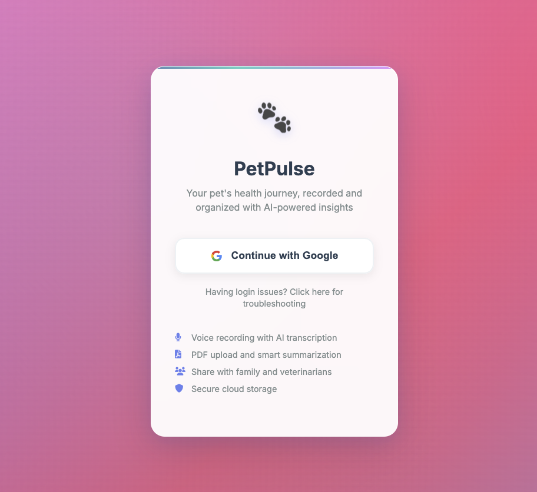
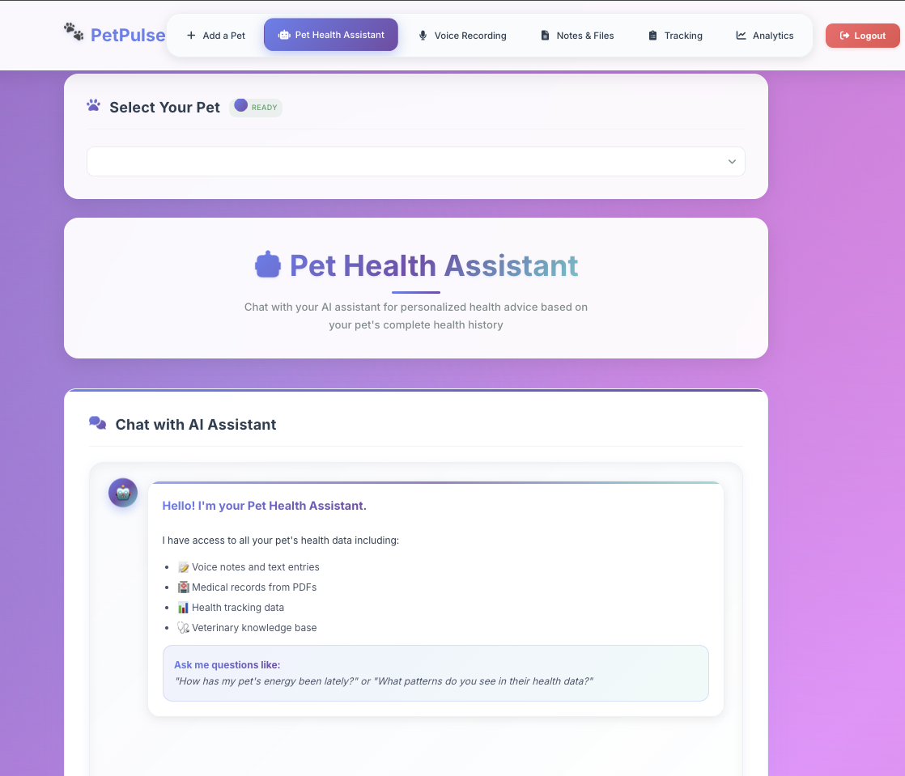

# PetPulse

[](https://python.org)
[](https://fastapi.tiangolo.com/)
[](https://openai.com/)
[](https://firebase.google.com/)
[](LICENSE)

<p align="center">
  
</p>

## The Problem

I noticed this pattern repeatedly among pet owners I know: subtle health changes that develop gradually often go untracked until they become obvious problems. Dogs start eating slightly less over weeks, but owners cannot pinpoint when it began or describe the progression clearly to vets. Cats become less active, dismissed as "getting older" until vet visits reveal underlying conditions that could have been caught earlier.

When I researched existing solutions, I found a clear gap: basic pet apps offer simple logging with no intelligence, while sophisticated health monitoring tools are designed for veterinary clinics, not individual pet owners. There was no solution that could intelligently analyze home observations and provide meaningful health insights for regular pet owners.

## What I Built

I built this after observing a frustrating pattern among friends and family with pets: they'd mention subtle behavioral changes to vets weeks later, but could never remember exactly when they started or how they progressed. "He's been less energetic lately" - but was it since last Tuesday, or three weeks ago?

This system lets pet owners quickly record observations by voice, then uses AI to track patterns they'd miss otherwise. When someone says "Max didn't finish his breakfast and seems tired," it categorizes this as a potential health concern and connects it to previous observations about energy levels.

The AI assistant can answer questions like "When did I first mention Max being tired?" or "Show me his eating patterns this month" - connecting dots that owners would never remember to connect manually.

**Core Features:**
- **Voice Recording**: Tap to record observations, automatic transcription
- **AI Health Analysis**: Categorizes notes (medical vs. daily activity) and extracts health patterns  
- **Smart Charts**: Ask "show me energy levels" and get the right visualization automatically
- **PDF Processing**: Upload vet records, get AI summaries
- **Pattern Recognition**: Identifies trends across multiple observations
- **Multi-Pet Support**: Track multiple pets with shared family access

<p align="center">
  
</p>

## Technical Challenges I Solved

**OpenAI API costs got expensive fast**
Every chart generation was hitting OpenAI's API, and with testing and multiple users, costs were adding up quickly. I implemented a 30-minute cache for recent queries - now repeated requests are instant and my API costs dropped by about 67%.

**Raw speech transcripts weren't useful enough**
Google's Speech-to-Text gives you exactly what was said, but "Max was limping today but ate his dinner fine" as raw text doesn't help much. I added a second AI step that extracts the important health info and categorizes it (medical concern vs. normal activity).

**Users wanted different chart types for different questions**
"Show me feeding times" needs a different visualization than "show me energy trends over time." Instead of building complex chart configuration UI, I used OpenAI function calling to parse the question and automatically pick the right chart type and data.

**Multi-device syncing**
You notice something on your phone but want to analyze trends on your computer. Firebase's real-time database handles this - notes appear instantly across devices without refresh.

## Technical Architecture

**Backend Stack:**
- **FastAPI**: Async Python web framework with automatic OpenAPI docs
- **Browser MediaRecorder**: voice notes are recorded in the browser and uploaded
- **Google Speech-to-Text**: Enterprise speech recognition with 95%+ accuracy
- **OpenAI GPT-4**: Content classification, summarization, and function calling
- **Firebase**: Firestore (NoSQL database) + Auth + Storage

**AI Processing Pipeline:**
```python
# 1. Speech capture → Google Speech API → raw transcript
# 2. Raw transcript → OpenAI → structured health data + classification
# 3. Health data → Analytics system → trend analysis + visualizations
```

**Caching Strategy:**
- 30-minute TTL for expensive AI responses
- 67% reduction in API costs for repeated queries
- In-memory cache (Redis recommended for production)

**Key Design Decisions:**
- **Async/await throughout**: Handle concurrent AI API calls efficiently
- **Function calling over parsing**: GPT-4 generates structured chart parameters
- **NoSQL for pet data**: Naturally hierarchical, frequently updated
- **Voice-first UX**: Faster than typing when observing concerning behavior

## Core Implementation

**OpenAI Function Calling:**
```python
chart_functions = [
    {
        "name": "generate_chart",
        "description": "Create visualizations for pet health data",
        "parameters": {
            "type": "object",
            "properties": {
                "chart_type": {"type": "string", "enum": ["bar", "line", "doughnut"]},
                "data_category": {"type": "string", "enum": ["diet", "exercise", "energy"]},
                "time_range": {"type": "string", "enum": ["week", "month", "3months"]}
            }
        }
    }
]
```

**Caching System:**
```python
@app.post("/api/pets/{pet_id}/analytics")
async def get_analytics(pet_id: str):
    cache_key = f"analytics_{pet_id}"
    
    if cache_key in cache:
        return cache[cache_key]  # Instant response
    
    result = await process_with_openai(pet_id)
    cache[cache_key] = result  # Store for 30 minutes
    return result
```

**AI Classification Pipeline:**
```python
# Step 1: Speech → Text
transcript = await speech_client.recognize(audio_data)

# Step 2: Text → Structured Health Data
health_data = await openai.chat.completions.create(
    model="gpt-4",
    messages=[
        {"role": "system", "content": "Extract health observations..."},
        {"role": "user", "content": transcript}
    ]
)
```

## How It Performs

The caching implementation significantly improved performance - repeated requests now return instantly instead of waiting 2-3 seconds for OpenAI responses.

I built approximately 20 different API endpoints, which sounds extensive but FastAPI makes them straightforward to implement. The automatic documentation feature eliminates the need to maintain separate documentation.

Firebase handles multiple users automatically, which simplified development. I did not need to implement custom user management or authentication flows.

## Project Structure

```
pet-voice-notes/
├── petpulse/                 # the backend (FastAPI): uvicorn petpulse.app:app
│   ├── app.py                # app factory: middleware, startup seed, router registration
│   ├── core/                 # config, auth, errors, logging, deps, firebase, timeutil
│   ├── routers/              # HTTP routes (health, demo, pets, records, analytics, notes,
│   │                         #   assistant, insights, voice)
│   ├── services/             # notes, chat (assistant), insights, charts, voice, PDF, pets
│   ├── llm/                  # LLM client, schemas, versioned prompts, fake rules
│   ├── providers/            # LLM + speech-to-text providers (fake, OpenAI, Google)
│   ├── store/                # Store interface: local JSON / in-memory / Firestore, blob stores
│   ├── schemas/              # request/response models
│   └── seed/                 # demo data and bundled audio/PDF samples
├── public/                   # the UI (index.html login, main.html dashboard, js/, vendored libs)
├── tests/
│   ├── unit/                 # modules and services, no HTTP
│   ├── integration/          # the app over HTTP, scripts, the entry points
│   └── js/                   # node:test tests for public/js
├── evals/                    # note-extraction eval cases, gold labels, scorer
├── scripts/                  # smoke_live.py (live/fake smoke test), make_samples.py
├── docs/                     # quick-start, api-contract, firebase, live-smoke, images/
├── requirements/             # base.txt, dev.txt, live.txt (pinned locks; *.in are the sources)
├── Dockerfile, docker-compose.yml, Makefile, pyproject.toml, .env.example
└── firestore.rules, storage.rules, firebase.json   # Firebase rules (optional Firebase mode)
```

`petpulse/app.py` holds no route bodies: each feature has a router in `petpulse/routers/` that
stays thin and calls a service in `petpulse/services/`. Storage and AI providers come from
`petpulse/core/deps.py`, so every feature runs on deterministic fakes in demo mode.

## Data Structure

The same paths are used by the local JSON store and by Firestore:

```
users/{userId}
  └── name, email, demo, created_at

pets/{petId}
  ├── name, animal_type, breed, age, weight, gender, owners: [userId, ...]
  ├── notes/{noteId}         - typed, voice and PDF notes (source: "text" | "voice" | "pdf")
  │   ├── text, summary, kind, urgent, needs_review
  │   ├── red_flags: [{flag, status, sentences}], observations: [...]
  │   └── created_at, tz, mode: "demo" | "live"
  ├── records/{recordId}     - uploaded vet-record PDFs (summary, pages, status)
  └── analytics/{entryId}    - structured tracking from the dashboard forms
       ├── category: "diet" | "exercise" | "medication" | "energy_levels" | ...
       └── category fields, timestamp
```

Each note is processed once (`petpulse.services.notes.process_note`) to extract observations
and red flags. Chat answers and insights are computed from these notes and analytics entries,
with citations back to the records they came from.

## Getting Started

**Demo (no keys, no accounts):** Docker Compose v2.24+.
```bash
git clone https://github.com/dhyeynala/pet-voice-notes.git
cd pet-voice-notes
docker compose up --build        # http://localhost:8000 ; health: /api/health
docker compose down -v           # reset demo data
```
With no `.env` the app runs in **demo mode**: deterministic fake AI providers, a local JSON
store under `data/`, and no network calls to OpenAI, Google or Firebase. `/api/health` reports
the mode of every AI feature.

**Live AI (optional):** `cp .env.example .env` and set `OPENAI_API_KEY`. Providers default to
`auto`, so they switch to OpenAI when the key is present (calls are billed). See
[.env.example](.env.example) for every setting.

**Firebase (optional):** Firestore storage and Firebase sign-in work the same way:
`STORE_BACKEND` / `AUTH_PROVIDER` default to `auto` and switch to Firebase only when its
credentials are configured. See [docs/firebase.md](docs/firebase.md).

**Run without Docker:**
```bash
pip install -r requirements/base.txt -r requirements/dev.txt   # or: make install
uvicorn petpulse.app:app --reload                                 # or: make run
pytest                                                            # or: make test
```

> Auth is a demo login: `POST /api/demo/login {"uid": "alice"}` returns a bearer token for every
> other `/api` call (Alice owns Max and Luna, Bob owns a different Max). With Firebase configured
> the login page offers Google / email sign-in instead and the Firebase ID token is the bearer token. See
> [docs/api-contract.md](docs/api-contract.md) and [CONTRIBUTING.md](CONTRIBUTING.md).

## API Reference

FastAPI generates interactive documentation at `http://localhost:8000/docs`; the full contract is
in [docs/api-contract.md](docs/api-contract.md). Every `/api` route except health, auth config and
the demo login needs a bearer token, and every pet route checks that the caller owns the pet.

**Sign-in & pets:**
- `POST /api/demo/login` - Demo login (`{"uid": "alice"}`) returns a bearer token
- `GET /api/me/pets` - The caller's pets; `POST /api/pets` creates one

**Voice & notes:**
- `POST /api/pets/{pet_id}/voice-notes` - Upload a browser recording (`audio`, webm/ogg/mp4/wav) or a bundled `sample_id`; transcribe and store it as a note
- `GET /api/voice/samples` - Bundled sample recordings (work without a microphone)
- `POST /api/pets/{pet_id}/notes` - Add a typed note; `GET` lists notes

**Assistant & analytics:**
- `POST /api/pets/{pet_id}/chat` - Questions answered from the pet's records, with citations
- `GET /api/pets/{pet_id}/insights` - Facts and alerts computed from notes and analytics
- `POST /api/pets/{pet_id}/analytics/{category}`, `GET /api/pets/{pet_id}/analytics` - Structured tracking data

**Vet records:**
- `POST /api/pets/{pet_id}/records` - Upload a PDF; it is summarized and stored
- `GET /api/pets/{pet_id}/records`, `GET /api/pets/{pet_id}/records/{record_id}/file`

**System:**
- `GET /api/health` - Health check and per-feature Demo/Live mode

## Development & Testing

**Local Development:**
```bash
make install     # pip install -r requirements/base.txt -r requirements/dev.txt
make run         # uvicorn petpulse.app:app --reload (http://localhost:8000)
make test        # pytest (tests/unit, tests/integration) + node --test tests/js/*.test.mjs
make lint        # black --check, flake8, mypy (strict, petpulse/), bandit, detect-secrets
make smoke-fake  # python scripts/smoke_live.py --allow-fake (what CI runs)
```

**Docker:**
```bash
docker compose up --build
```

**Testing API Endpoints:**
```bash
# Health check
curl http://localhost:8000/api/health

# Demo token for Alice, then her pets
TOKEN=$(curl -s -X POST -H 'Content-Type: application/json' -d '{"uid":"alice"}' \
  http://localhost:8000/api/demo/login | python -c 'import json,sys; print(json.load(sys.stdin)["token"])')
curl -H "Authorization: Bearer $TOKEN" http://localhost:8000/api/me/pets

# Voice note from a bundled sample
curl -X POST -H "Authorization: Bearer $TOKEN" -F sample_id=vomiting_blood -F tz=America/New_York \
  http://localhost:8000/api/pets/$PET_ID/voice-notes

# Ask the assistant
curl -X POST -H "Authorization: Bearer $TOKEN" -H 'Content-Type: application/json' \
  -d '{"message":"Why was he limping?","tz":"America/New_York"}' http://localhost:8000/api/pets/$PET_ID/chat
```

## Performance & Metrics

**Measured Improvements:**
- Response time: 2.5s → 0.5s (with caching)
- API cost reduction: 67% for repeated queries
- Cache hit rate: ~85% during normal usage
- Speech recognition accuracy: 95%+ with Google Cloud

**Concurrent Processing:**
- Async FastAPI handles multiple voice transcriptions simultaneously
- Firebase real-time sync appears instantly across devices
- Background AI processing doesn't block user interactions

**Production Considerations:**
- Replace in-memory cache with Redis for scale
- Add comprehensive error monitoring and logging
- Implement rate limiting for AI API calls
- Consider WebSocket for real-time AI chat

## Next Steps

**Computer Vision Integration**: Add photo analysis to track visual changes like weight loss or coat condition over time. This could help catch gradual changes that are hard to notice day-to-day.

**Mobile App**: Build native iOS/Android apps for better camera integration and offline note-taking. The mobile web version works but has limitations with camera access and offline functionality.

**Advanced Pattern Detection**: Implement algorithms that automatically flag concerning trends before they become obvious to owners - like detecting gradual appetite changes across multiple observations.

**Veterinary Integration**: Build API endpoints for vets to access patient history (with owner permission) and add professional observations to the timeline.

---

I built this during an internship to learn how modern AI APIs work together in practice. The goal was understanding these technologies deeply, not just using them superficially.